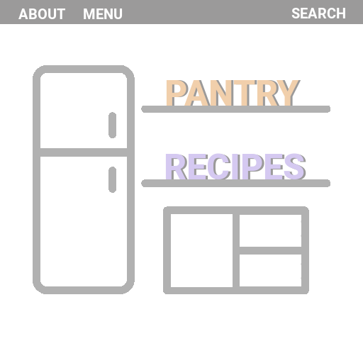

# Team Project - 3308

## PROJECT DEADLINES:

  | Milestone | Deadline |   Description                         |
  | --------- | -------- | ------------------------------------  |
  |     1     |  Feb. 5  | Project Proposal                      |
  |     2     |          | Agile Meeting (Zoom with instructor)  |
  |     3     |          | Testing                               |
  |     4     |          | Individual Interview                  |
  |     5     |          | Presentation (5-10min)                |
  |     6     |  May 4   | Final Submission                      |
  |     7     |          | Peer Evaluation & Project Reflectiton |

## Project title - Grocery Planner
Grocery planner name ideas:\
Pantry Planner, Fridge Friend, Comida, Fresh Comida, Food Saver, 

# Comments, Ideas, Visuals etc

if you want to add images from the "Pictures" folder, do the following:

if you want to add images from the web:

Thanks!\
I found a (mobile) app that kind of does what we're trying to make, it includes what it calls 'pantry management and tracking.' The app has a fun name: Out of Milk. https://www.outofmilk.com/ideas/pantry-management-tips-ideas/ \
This other one lets you choose the ingredients you have and shows recipes that you can make: https://myfridgefood.com/ \
~ Saloni

